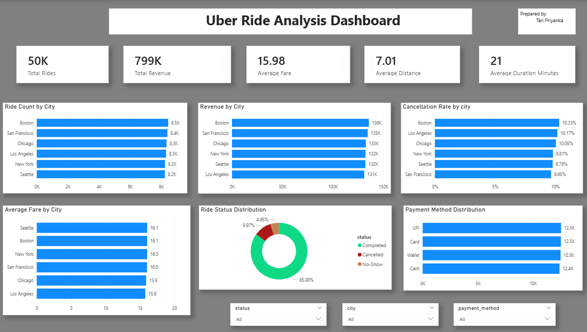

# 🚖 Uber Ride Analysis Dashboard

An end-to-end Data Analytics project built using **Python, Pandas, Power BI, and DAX** to analyze **50,000 Uber ride records** and generate business insights.

---

# 📌 Project Overview

This project explores Uber ride data to identify ride demand, revenue trends, payment preferences, cancellation rates, and ride duration.

The dashboard helps stakeholders monitor operational performance and make informed business decisions.

---

# 🛠️ Tech Stack

- Python
- Pandas
- NumPy
- Power BI
- DAX
- Google Colab

---

# 📊 Dataset

The dataset contains **50,000 Uber ride records** with:

- Trip ID
- Driver ID
- Rider ID
- City
- Pickup & Drop Locations
- Distance
- Fare Amount
- Ride Status
- Payment Method
- Pickup & Drop Time

---

# 📈 Key Business Questions

- Which city generated the highest revenue?
- Which city completed the highest number of rides?
- What is the average fare by city?
- What is the cancellation rate across cities?
- Which payment method is used the most?
- What is the average ride duration?

---

# 📊 Dashboard Features

- Total Rides
- Total Revenue
- Average Fare
- Average Distance
- Average Ride Duration
- Revenue by City
- Ride Count by City
- Cancellation Rate
- Ride Status Distribution
- Payment Method Distribution
- Interactive Filters

---

# 📷 Dashboard Preview

---

# 💡 Key Insights

- Boston generated the highest revenue.
- Boston recorded the highest number of rides.
- Card was the most preferred payment method.
- Completed rides accounted for nearly 85% of total rides.
- Average ride duration was approximately 21 minutes.

---

# 👩‍💻 Author

**T Priyanka**
